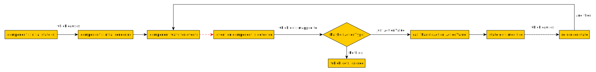

# Adding Events

We'll now show how to change the state of the component via event handling. The simplest example is a button that gets toggled to an `on` or `off` state.

Refer to the below flowchart to understand how Halogen event-handling works.



We'll use a 4-step process to add event-handling to our component.
1. Add an event handler to an HTML tag
2. Indicate via `Maybe` whether or not to continue processing the event
3. Convert the event into a value of an `action` type (a domain-specific language that stores all info for properly handling the event).
4. Handle that `action` type's value to handle the event.

This approach is flexible. For example, one can handle multiple events in the same way. One could convert click events and keyboard events to the same `action` value and then handle that `action` in the same way.

In Step 1, we add event handlers using Halogen's HTML DSL. The syntax looks like this:
```purescript
import Halogen.HTML.Events as HE

HH.button
  [ HE.onEventName (\event -> {- this part will be explained next -}) ]
  [ HH.text "Button text" ]
```

In Step 2, the event might have all the information we need to determine whether we should handle it or ignore it. For an "ignore" example, we might not want to respond to mouse clicks that have the <kbd>CTRL</kbd> button pressed. Since we do not need any other information to make this decision, we return `Nothing` to indicate to Halogen that there's nothing else that needs to be done.
For example `\_ -> Nothing`

In other cases, we want to handle the event or we require information that isn't accessible at that point as to whether to handle it or ignore it. In such cases, we return `Just ...` to indicate to Halogen that we should continue processing this event.
For example `\event -> Just ...`

For our button example, we'll respond to `click` events on the button regardless of whether the click event has any modifiers pressed. We don't need any information about the mouse event (e.g. screen location, click count, etc.). The fact that it happened is all we care about.
Thus, we'll use `\_ -> Just ...` to ignore the event and indicate that this event should be handled by Halogen.

In Step 3, we define an `action` type whose values store all the information we'll need to properly handle all the component's events, and then convert the event to a value of that type.

For our example, we do not need to store anything about the event or which button was clicked. So, this will be `data Action = Toggle`
Our above function is now: `\_ -> Just Toggle`

In Step 4, we handle the `action` type's value by running monadic code. The monad is `HalogenM`, which eventually gets run in the `Aff` monad.

Since Step 4 allows us to use side-effectful monadic code, we can get additional information (e.g. does this user exist in the database?) before deciding whether to handle the event-turned-action or not.

To update the component's state, we'll use `get`/`put`/`modify_` from the `MonadState` type class.

```purescript
import Control.Monad.State (get, put)

handleAction :: HandleSimpleAction State Action
handleAction = case _ of
  Toggle -> do
    oldState <- get
    let newState = not oldState
    put newState
```

Now look at the next file for the full example.

## Compiling Instructions

To compile the next file and view its results in the browser, use these instructions.

```bash
spago bundle -m DynamicHtml.AddingEventHandling -t assets/dynamic-html/adding-event-handling.js
parcel serve assets/dynamic-html/adding-event-handling.html -o adding-event-handling--parcelified.html --open
```
