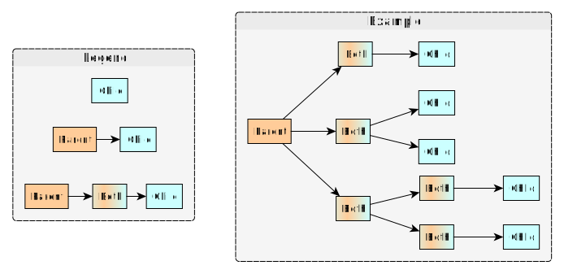
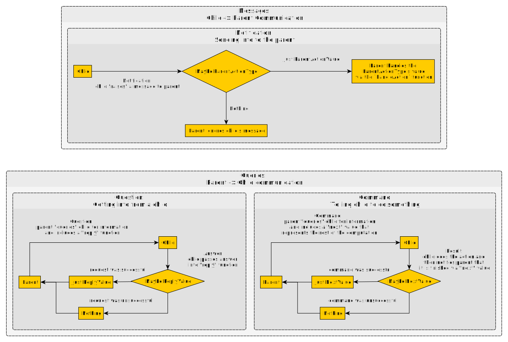
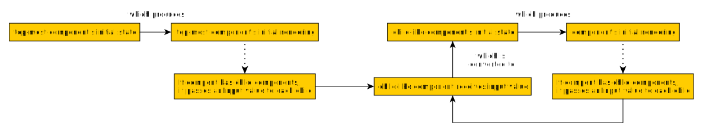

# Parent-Child Relationships

This page provides an overview of parent-child relationships in 4 parts. Then we'll cover specific aspects of these ideas in separate files that focuses on a single idea and includes examples.
1. Capability-based components
2. slot addresses
3. parent-child communication
4. rendering childlike components

## Capability-Based Components

Halogen does not distinguish a "child" component from a "parent" component. Rather, one should think of components as having capabilities that are "child-like" and/or "parent-like." For example, "child-like" components can do X and Y, but not Z. In reality, all components are configured to have "child-like" capabilities, "parent-like" capabilities or both capabilities.

For example

A "parent" component can
- render other components (it's children)
- query one of more of its children
    - by "requesting" information (e.g. "Could you tell me your counter's state?")
    - by "telling" it/them to do something (e.g. "Increase your counter by 1")

These are a few examples of "parent" components:
- a container-like component that lays out child components in a specific way
- a coordinator component that syncs state between multiple child components

A "child" component can
- respond to its parent component's instructions:
    - requests: "My counter's state? Oh, it's 4"
    - tells/commands: "Ok. I will increment my counter by 1"
- notify a parent component of an event by "raising" a message (e.g. "Hey parent! I was clicked!")

A component that has both "parent" and "child" capabilities
- has all the "parent" capabilities
- has all the "child" capabilities
- can forward its parent's query down to its children
- can forward its children's messages to its parent

## The Problem of Multiple Children and the Solution of Slot Addresses

Let's say a parent-like component has one child-like component. If the parent needs to query its child, it's obvious which one to query. Similarly, when its child raises a message, it's obvious which one is emitting that message.

When a parent has two or more children, it's no longer obvious. Rather, we need an address system. This is what "slots" do. They help
- you know which child is "raising" a message
- you know which child to "query" (either ask for info or command something)

Moreover, when a parent has multiple children, each child component may have different types used to communicate with their parent. So, this address system must also use the compiler to prevent you from using Child A's type when you were referring to Child B.

We'll show how this address system works after covering the next two points.

## Parent-Child Communication

There are 2 kinds of communication but 3 communication possibilities:
1. queries (parent -> child):
    1. Parent "requests" information from child
    2. Parent "tells" child to do something
2. messages (child -> parent):
    3. Child "raises" a message about something to its parent.

In simple terms, Halogen models their communication in this way:

### Parent to Child Communication

When a parent executes a query, it notifies the child and includes a "callback" of sorts, either a "reply" function or a "next" value.
- **"reply" function:** think of this as a pre-paid return package: the child puts the information the parent requested into the box and it gets "mailed" back to the parent. Once received, the parent continues its computation with this additional information.
- **"next" value:** think of this as the computations the parent will do once the child is finished doing the parent's command.

(If one has read through my learning repo and the part on how to structure programs using the `Free` monad, queries work just like that. The higher-level language (parent) is "interpreted" into the lower-level language (child).)

### Child to Parent Communication

A child cannot know which parent may contain it. Thus, when a child wishes to notify the parent that something has occurred, it "raises" a message to the parent. Since this might differ from its `Action` type, we use the `Message` type for this.

If we reuse the child component across multiple unrelated parent components, each might handle it differently.

Thus, a parent responds to a child's message just like an event:
1. Determine via `Maybe` whether to handle the "event" (i.e. child message)
1. Convert the event into a value of the parent's `Action` type.
2. Handle that action value.

We define this `ChildMessageType -> Maybe ParentActionType` mapping when we declare the child-like component in the parent-like component's `render` function.

## Rendering

### Initial Rendering

When a "parent-like" component renders a "child-like" component, sometimes the "child-like" component's initial state and initial rendering is always the same across program runs. In other words, we can hard-code these values. When the parent renders the child, the child does not need any information from the parent.

In other cases, the initial state of the "child-like" component might depend on information the "parent-like" component has. In other words, these values are different when we run the code multiple times.

For example, a "parent-like" component (e.g. a layout pane) might know what the "current user" is. This user will change across program runs, so we cannot hard-code the initial state of the "child-like" component (the avatar part of the user's profile page). Rather, the parent-like component should pass this information into the child-like component.

To accomplish this, a parent can pass into a child a value of the `Input` type. For example

A child can do one of three things with that value:
1. Ignore it:
    - `\_ -> hardCodedInitialState`
    - `const hardCodedInitialState`
2. Use the `Input` value as it's initial `State` value:
    - `\x -> x`
    - `identity`
3. Do something more custom depending on what it is:
    - `\x -> if isEmpty x then Nothing else Just x`

We define this mapping in the `initialState` part of our code.

### Each Re-Render Thereafter

After the initial rendering, if the parent ever re-renders itself (due to its state being changed), it will pass a value of the `Input` type back into the child. Sometimes, the child will want to respond to such changes, and other times it won't.

Thus, a child-like component responds to a parent's `input` value just like an event:
1. Determine via `Maybe` whether to handle the "event" (i.e. parent was re-rendered and is passing a value of `Input` into the child-like component)
2. Convert the event into a value of the child's `Action` type.
3. Handle that action value.

We define this mapping in the `receive` part of our code.
