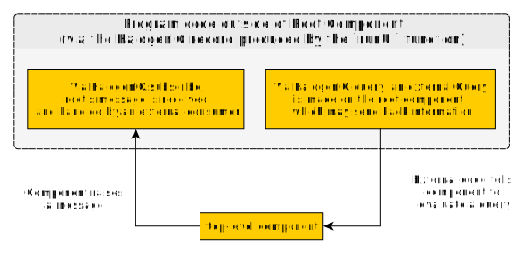

# Driver

In this folder, we'll show how to use the VDOM's driver to do the following things:
- run the top-level component as a child in
    - the `body` element in a blank HTML page (e.g. if we were running an SPA)
    - a specific element in our HTML page (e.g. if we were in the process of migrating pieces of our code from one library/framework/language to PureScript and Halogen)
- query the top-level component using `request`- and `tell`-style queries
- handle messages raised by the top-level component
- remove a component after a given time

Similar to the parent-child relationships folder, each of the below section has a corresponding file(s) that explains this more.

## Running a component with `runUI`

Section's corresponding files:
- `Running-Components`
- `Embedding-Components`

To run our component, we use the `runUI` function from the `Halogen.VDOM.Driver` module, not the `Halogen.Aff.Driver` module.

However, `runUI` requires an HTML element that is the component's parent. Usually, this will be the `body` element.

Regardless of which element is used, the general process looks like this:
1. Wait for the page to load
2. Find the element that will be the top-level component's parent (usually, `body`)
3. Run the component

For example
```purescript
main :: Effect Unit
main =
  runHalogenAff do
    awaitLoad
    targetElement <- -- function that finds the element
    runUI topLevelComponent topLevelComponentInput targetElement
```

Since `awaitLoad` and a function that finds the body are frequently used, we can combine these two together using `awaitBody`

```purescript
main :: Effect Unit
main =
  runHalogenAff do
    body <- awaitBody
    runUI topLevelComponent topLevelComponentInput body
```

## A Note on Using `runHalogenAff` instead of `runAff`, `launchAff`, or `launchAff_`

Normally, when we want to run an `Aff` computation, we would write:
```purescript
main :: Effect Unit
main = do
  fiber <- runAff callback affComputation
  -- might use fiber to cancel Aff computation or something...
  pure unit
  where
  callback :: Either error result -> Effect Unit
  callback = case _ of
    Left error -> pure unit
    Right result -> pure result
```

Since we often don't care about the error in `Aff` (e.g. it can't error), you will typically see people write `launchAff` instead:

```purescript
main :: Effect Unit
main = do
  fiber <- launchAff affComputation
  -- might use fiber to cancel Aff computation or something...

  -- variant of `launchAff` when we don't care for the fiber or possible error
  launchAff_ affComputation
  pure unit
```

However, using these `launchAff` variants will mean never rethrowing any runtime errors that might occur. Thus, Halogen provides `runHalogenAff`, which simply rethrows a runtime error if it occurs:
```purescript
main :: Effect Unit
main = do
  runHalogenAff affComputation
  where
  runHalogenAff :: Aff a -> Effect Unit
  runHalogenAff affComp = void $ runAff callback affComp
    where
    callback :: Either error result -> Effect Unit
    callback = case _ of
      Left error -> throwException error
      Right _ -> pure unit
```

## Communicating with the top-level component via the `HalogenIO` type (a record)

`runUI` returns a record with the type, `HalogenIO`:

```purescript
main :: Effect Unit
main =
    runHalogenAff do
      body <- awaitBody
      io <- runUI topLevelComponent input body

      io.entityName
```

This record stores three entities. Each is described below:
1. `io.query`: Send `request`- and `tell`-style queries into the top-level component as though we are a parent component
2. `io.subscribe`: Subscribe to the messages the top-level component raises
3. `io.dispose`: Remove the top-level component from the target element and clean up any resources

The first two can be visualized like so:


### Sending Queries into the Top-Level Component

Section's corresponding files: `Querying-Components`

We can query the top-level component as though it were a child component. There are two differences from how a parent queries its child:
- In this situation, we use `io.query` instead of `H.query`
- In this situation, we do not need to add the `_childLabel childIndex` values as arguments to the `query` function. Since there can only be one top-level component per `HalogenIO` record value, the 'child' in question is obvious.

For example:
```purescript
main :: Effect Unit
main =
    runHalogenAff do
      body <- awaitBody
      io <- runUI topLevelComponent input body

      -- run a request-style query
      requestResult <- io.query $ H.request $ GetInfoFromChild

      -- run a tell-style query
      tellResult <- io.query $ H.tell $ TellChildSomething 4
```

Note: sending queries into the root component, when evaluated, will run a monadic computation that outputs a `Maybe a` rather than `a`. This single type models three possibilities:
1. The root component was a part of the DOM, and one later called `halogenIO.dispose` (covered later in this file). In such a case, the root component is no longer a part of the DOM, so `Nothing` is returned.
2. The root component is a part of the DOM, but some error occurred when evaluating the query. In such a case, `Nothing` will be returned.
3. The root component is a part of the DOM and the query was successful. In such a case, `Just a` will be returned.

### Subscribing to Messages Raised by the Top-Level Component

Section's corresponding files: `Subscribing-to-Messages`

When a parent gets notified of a child component's message, it maps the child's message to the parent's action type and handles that action. The `HalogenIO` record type does not have an action type, so we need a different way to respond to messages.

The `HalogenIO` record needs to respond to each message raised by the top-level component. This is accomplished via a push-based communication. The top-level component (producer) pushes out a message, to which the `HalogenIO` record (consumer) responds.

Moreover, the `HalogenIO` record is different from the parent component in two ways
1. multiple consumers run code when the top-level component produces a single message
2. each consumer can be configured to respond to just the first event, multiple events until a condition is met, or for the life of the component

The second is possible based on what the consumer returns in its monadic computation:
- `pure $ Just unit` - continue responding to future messages
- `pure Nothing` - stop responding to future messages

Thus, we can write something like this in code:

```purescript
import Control.Coroutine as CR

main :: Effect Unit
main =
  runHalogenAff do
    body <- awaitBody
    io <- runUI topLevelComponent unit body

  -- first consumer
  io.subscribe $ CR.consumer \messageRaisedByTopLevelComponent -> do
    -- do something in the Aff context with that message
    liftEffect $ log $
      "Top-Level Component raised a message: " <>
      show messageRaisedByTopLevelComponent
    pure $ Just unit

  -- second consumer
  io.subscribe $ CR.consumer \messageRaisedByTopLevelComponent -> do
    -- do something in the Aff context with that message
    liftEffect $ log $
      "This consumer only runs once and then ignores any future messages \
      \because it returns 'Nothing' instead of 'Just unit'"
    pure Nothing
```

### Disposing a Top-Level Component

Section's corresponding files: `Disposing-Components`

Sometimes, we want to remove a top-level component after it's fulfilled its purposes. Perhaps we have a top-level application component that we want to separate from a top-level "loading" component. In such a case, we could render the 'loading' component and then remove it and replace it with the 'application' component.

To remove a top-level component and cleanup any resources it used, we use `io.dispose`.

For example:
```purescript
main :: Effect Unit
main =
    runHalogenAff do
      body <- awaitBody
      io <- runUI topLevelComponent input body

      -- do stuff with our component for a while....

      -- now remove it
      io.dispose
```
